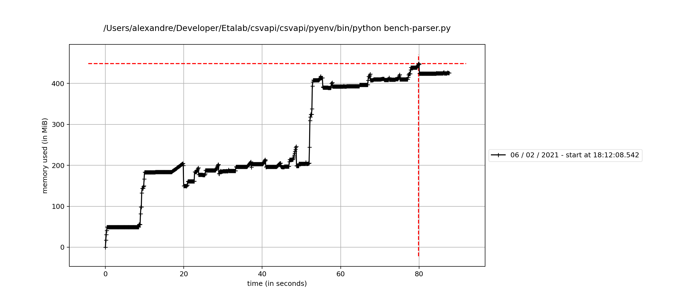
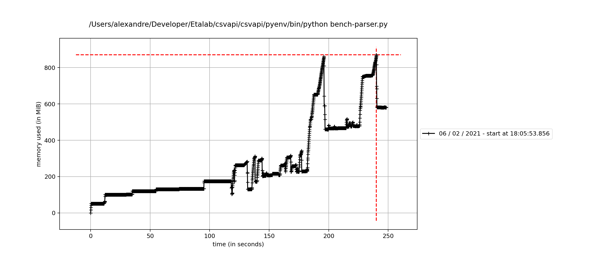
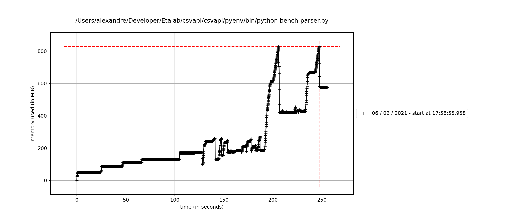
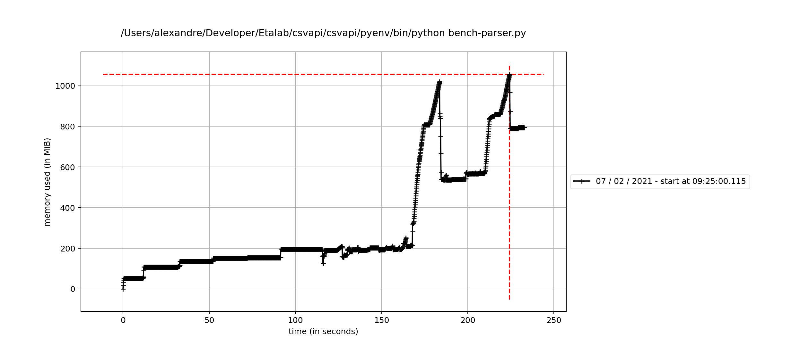
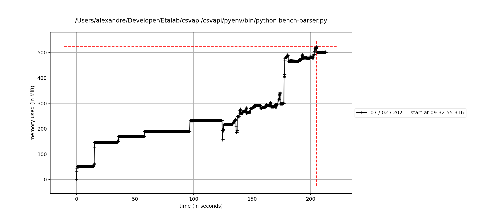

# Benchs

## Parser

Test corpus: https://github.com/abulte/csv-data-samples/tree/20210207

`bench-parser.py`

Report memory consumption:

```
mprof run bench-parser.py
mprof plot
```

### Agate standalone

```
Errors: 7/1000 (0.7%)
Column warnings: 105/1000 (10.5%)
Not CSV (magic): 10/1000 (1.0%)
mprof run bench-parser.py  0,18s user 0,11s system 0% cpu 1:27,87 total
```



### clevercsv

#### Forcing clevercsv dialect to Agate

With default quoting " instead of ''

```python
detected = detect_dialect(filepath, encoding=encoding, num_chars=SNIFF_LIMIT)
dialect = detected.to_dict() if detected else {}
dialect['quotechar'] = dialect['quotechar'] if dialect['quotechar'] else '"'
kwargs = {
    # hack to let us pass a custom dialect
    'sniff_limit': -1,
    # 'sniff_limit': SNIFF_LIMIT,
    'encoding': encoding,
    'column_types': agate_tester(),
    **dialect,
}
return agate.Table.from_csv(filepath, **kwargs)
```

```
Errors: 9/1000 (0.9%)
Column warnings: 106/1000 (10.6%)
Not CSV (magic): 10/1000 (1.0%)
```

#### clevercsv.read_dicts

```python
data = read_dicts(filepath, encoding=encoding, num_chars=SNIFF_LIMIT)
return agate.Table.from_object(data, column_types= agate_tester())
```

```
Errors: 2/1000 (0.2%)
Column warnings: 95/1000 (9.5%)
Not CSV (magic): 10/1000 (1.0%)
mprof run bench-parser.py  228,20s user 9,02s system 95% cpu 4:08,55 total
```



#### clevercsv.stream_dicts

```python
data = stream_dicts(filepath, encoding=encoding, num_chars=SNIFF_LIMIT)
return agate.Table.from_object(data, column_types= agate_tester())
```

```
Errors: 2/1000 (0.2%)
Column warnings: 95/1000 (9.5%)
Not CSV (magic): 10/1000 (1.0%)
mprof run bench-parser.py  0,39s user 0,28s system 0% cpu 4:15,72 total
```



### Agate w/ clevercsv fallback

```python
kwargs = {
    'sniff_limit': SNIFF_LIMIT,
    'encoding': encoding,
    'column_types': agate_tester(),
}
try:
    return agate.Table.from_csv(filepath, **kwargs)
except (ValueError, agate.exceptions.FieldSizeLimitError):
    data = stream_dicts(filepath, encoding=encoding, num_chars=SNIFF_LIMIT)
    return agate.Table.from_object(data, column_types=agate_tester())
```

```
Errors: 2/1000 (0.2%)
Column warnings: 107/1000 (10.7%)
Not CSV (magic): 10/1000 (1.0%)
```



### Agate cascading fallback w/ clevercsv fallback

```python
kwargs = {
    'sniff_limit': SNIFF_LIMIT,
    'encoding': encoding,
    'column_types': agate_tester(),
}
try:
    return agate.Table.from_csv(filepath, **kwargs)
except (ValueError, agate.exceptions.FieldSizeLimitError):
    try:
        kwargs.pop('sniff_limit')
        return agate.Table.from_csv(filepath, **kwargs)
    except (ValueError, agate.exceptions.FieldSizeLimitError):
        kwargs['delimiter'] = ';'
        try:
            return agate.Table.from_csv(filepath, **kwargs)
        except (ValueError, agate.exceptions.FieldSizeLimitError):
            data = stream_dicts(filepath, encoding=encoding, num_chars=SNIFF_LIMIT)
            return agate.Table.from_object(data, column_types=agate_tester())
```

```
Errors: 2/1000 (0.2%)
Column warnings: 106/1000 (10.6%)
Not CSV (magic): 10/1000 (1.0%)
mprof run bench-parser.py  191,76s user 6,64s system 93% cpu 3:33,30 total
```


